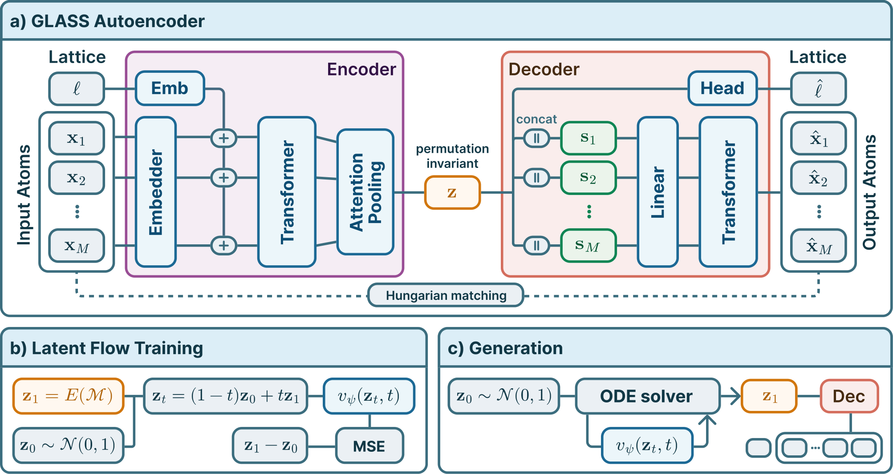

# GLASS: Global Latent Aggregation with Slot-based Set Decoding for Scalable All-Atom Crystal Generation

Hendrik Kraß, Seyed Mohamad Moosavi, Mathias Niepert



GLASS encodes a crystal into one permutation-invariant latent vector and decodes it
with learned slots trained by Hungarian matching. A flow in the latent space
generates new crystals.

## Installation

Install [uv](https://docs.astral.sh/uv/), then:

```bash
git clone https://github.com/henk789/glass
cd glass
uv sync
```

Training and sampling run on Linux, macOS, and Windows (NVIDIA GPU, Apple GPU, or CPU).

## Sampling from pretrained models

Pretrained checkpoints are on [Hugging Face](https://huggingface.co/henk789/glass).

```bash
uv run hf download henk789/glass mp20/seed0/flow_50k.pt --local-dir checkpoints
uv run python -m glass.sample --config configs/mp20.yaml --checkpoint checkpoints/mp20/seed0/flow_50k.pt --out runs/mp20/samples
```

```bash
uv run hf download henk789/glass qmof150/seed0/flow_1m.pt --local-dir checkpoints
uv run python -m glass.sample --config configs/qmof150.yaml --checkpoint checkpoints/qmof150/seed0/flow_1m.pt --out runs/qmof150/samples
```

Each run writes 10,000 structures to `samples.pt` and one CIF per valid structure.

## Training

```bash
uv run python -m glass.data configs/mp20.yaml
uv run python -m glass.train_autoencoder --config configs/mp20.yaml --out runs/mp20/ae
uv run python -m glass.train_flow --config configs/mp20.yaml --autoencoder runs/mp20/ae/model.pt --out runs/mp20/flow
```

The first command downloads and prepares the dataset. Replace `mp20` with `qmof150`
for QMOF150. Flow checkpoints are saved every 10k steps in `runs/mp20/flow/checkpoints/`.

Training time on one H100: about 20 minutes for the MP20 autoencoder and 3.5 hours for
the QMOF150 autoencoder; about 50 minutes for either flow (1M steps). The 50k-step MP20
checkpoint used for the MP20 benchmarks is reached after about 3 minutes.

## Evaluation

Evaluation requires Linux and a CUDA GPU. Install the benchmark tools once:

```bash
uv run python -m eval.setup genbench
uv run python -m eval.setup crystalite
uv run python -m eval.setup mofchecker
uv run python -m eval.setup mofid
uv run python -m eval.setup esen
```

`crystalite` needs the CUDA toolkit, `mofid` a C++ compiler, and `esen` access to
the gated [OMAT24](https://huggingface.co/facebook/OMAT24) models.

Evaluate the pretrained checkpoints:

```bash
scripts/evaluate_mp20.sh checkpoints/mp20/seed0/flow_50k.pt runs/mp20/benchmark
scripts/evaluate_qmof150.sh checkpoints/qmof150/seed0/flow_1m.pt runs/qmof150/benchmark
```

- **MP20:** LeMat-GenBench on 2,500 samples, raw and NequIP-relaxed; Crystalite metrics on 10,000 samples.
- **QMOF150:** MOFChecker validity, MOFid novelty and uniqueness, and similarity to
  training structures on raw samples; MOFChecker validity after relaxation.

Validity and yields are computed over all requested samples, counting failed
structures. Training-structure similarity is reported among valid samples.
Crystalite metrics use Crystalite's own evaluation pools.

Autoencoder reconstruction error:

```bash
uv run hf download henk789/glass mp20/seed0/autoencoder.pt --local-dir checkpoints
uv run python -m eval.reconstruction --config configs/mp20.yaml --autoencoder checkpoints/mp20/seed0/autoencoder.pt --out runs/mp20/reconstruction
```

## Fixed-grid experiment

```bash
uv run python -m toy.fixed_grid train --n 24 --seed 0 --method naive
uv run python -m toy.fixed_grid sample --run runs/toy/n24_seed0_naive
```

Methods are `naive`, `eqot`, and `decoder`. `scripts/toy.sh` runs the full study.

## License

MIT
